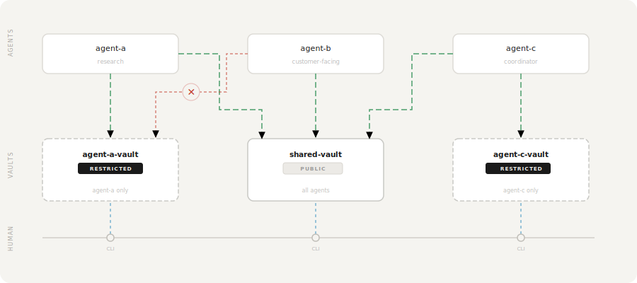

<div align="center">
<picture>
    <source media="(prefers-color-scheme: dark)" srcset="https://raw.githubusercontent.com/Filippo-Venturini/ctxvault/main/assets/logo_white_text.svg" width="400" height="100">
    <source media="(prefers-color-scheme: light)" srcset="https://raw.githubusercontent.com/Filippo-Venturini/ctxvault/main/assets/logo_black_text.svg" width="400" height="100">
    
</picture>

<h3>Local semantic memory infrastructure for AI agents</h3>
<p><i>Isolated vaults. Agent-autonomous. Human-observable.</i></p>

[](https://opensource.org/licenses/MIT)
[](https://pypi.org/project/ctxvault/)


[Installation](#installation) • [Quick Start](#quick-start) • [Examples](#examples) • [Documentation](#documentation) • [API Reference](#api-reference)

</div>

---

## What is CtxVault?

Most agent frameworks treat memory as an afterthought — a shared vector store queried with metadata filters, where isolation depends entirely on configuration staying correct. It works until it doesn't: multiple agents with different domains, a growing knowledge base, and the wrong document surfaces in the wrong place.

CtxVault is built around a different primitive. Memory is organized into **vaults** — self-contained, directory-backed units, each with its own documents and its own vector index. Isolation is structural. The topology is defined explicitly: one vault per agent, a shared knowledge base across multiple workflows, or any combination — with access control that determines exactly which agents can reach which vault.

The result is a memory layer that behaves like real infrastructure: composable, observable, persistent and entirely local.

<div align="center">
  
</div>

---

## Core Principles

### Structural isolation and access control

Isolation enforced through prompt logic or metadata schemas is fragile — it grows harder to reason about as systems scale, and fails silently when it breaks.

In CtxVault, each vault is an independent index. Agents have no shared retrieval path unless one is explicitly defined. Vaults can be declared restricted, with access granted to specific agents directly through the CLI. The boundary is part of the architecture, not a rule written in a config file that someone might later get wrong.

```bash
# Initialize a restricted vault and attach only the agent that should reach it
ctxvault init internal-docs --restricted
ctxvault attach internal-docs research-agent
```

---

### Persistent memory across sessions

Agents lose all context when a session ends. CtxVault gives them a knowledge base that persists across conversations, queryable by meaning rather than exact match. Context written in one session is retrievable days later using semantically related language.

<div align="center">
  
  <p><sub>Persistent memory across sessions — shown with Claude Desktop, works with any MCP-compatible client.</sub></p>
</div>

---

### Observable and human-controllable

When agents write to memory autonomously, visibility into what they write is not a debugging feature — it is the foundation of a trustworthy system.

Every vault is a plain directory on your machine. You can read it, edit it, and query it directly through the CLI at any point, independent of what any agent is doing. You also contribute to the same memory layer directly: drop documents into a vault, index with one command, and the agent queries that knowledge alongside what it has written on its own.

```bash
# Inspect what your agent has written in the vault
ctxvault list my-vault

# Query its knowledge base directly  
ctxvault query my-vault "what decisions were made last week?"

# Add your own documents and index them
ctxvault index my-vault
```

---

### Local-first

No cloud, no telemetry, no external services. Vaults are plain directories on your machine, the storage layer is entirely local. What you connect to that knowledge base is your choice.

---

## Integration Modes

CtxVault exposes the same vault layer through three interfaces. Use whichever fits your context, or combine them freely.

**CLI** — Human-facing. Monitor vaults, inspect agent-written content, add your own documents, query knowledge bases directly.

**HTTP API** — Programmatic integration. Connect LangChain, LangGraph, or any custom pipeline to vaults via REST. Full CRUD, semantic search, and agent write support.

**MCP server** — For autonomous agents. Give any MCP-compatible client direct vault access with no integration code required. The agent handles `list_vaults`, `query`, `write`, and `list_docs` on its own.

---

## CtxVault vs Alternatives

| | CtxVault | Pinecone / Weaviate | LangChain VectorStores | Mem0 / Zep |
|--|----------|---------------------|------------------------|------------|
| **Storage** | Local | Cloud | Local or cloud | Cloud |
| **Vault isolation** | Structural | ✗ | ✗ | Partial |
| **Access control** | ✓ | ✗ | ✗ | ✗ |
| **Human CLI observability** | ✓ | ✗ | ✗ | ✗ |
| **Agent write support** | ✓ | ✓ | ✗ | ✓ |
| **MCP server** | ✓ | ✗ | ✗ | ✗ |

---

## Examples

Three production-ready scenarios — each with full code and setup instructions.

| | Example | What it shows |
|--|---------|---------------|
| 🟢 | [**Personal Research Assistant**](examples/01-simple-rag/) | Semantic RAG over PDF, MD, TXT, DOCX. Ask questions, get cited answers. ~100 lines. |
| 🔴 | [**Multi-Agent Isolation**](examples/02-multi-agent-isolation/) | Two agents, two vaults, one router. The public agent has no retrieval path to internal documents — isolation enforced at the knowledge layer, not in prompt logic. ~200 lines. |
| 🔵 | [**Persistent Memory Agent**](examples/03-persistent-memory/) | An agent that recalls context across sessions using semantic queries. "financial constraints" retrieves "cut cloud costs by 15%" written three days prior. |

---

## Installation

**Requirements:** Python 3.10+

### From PyPI
```bash
pip install ctxvault
```

### From source
```bash
git clone https://github.com/Filippo-Venturini/ctxvault
cd ctxvault
python -m venv .venv && source .venv/bin/activate  # Windows: .venv\Scripts\activate
pip install -e .
```

---

## Quick Start

Both CLI and API follow the same workflow: create a vault → add documents → index → query. Choose CLI for manual use, API for programmatic integration.

### CLI Usage

```bash
# 1. Initialize a vault
ctxvault init my-vault

# 2. Add your documents to the vault folder
# Default location: ~/.ctxvault/vaults/my-vault/
# Drop your .txt, .md, .pdf or .docx files there

# 3. Index documents
ctxvault index my-vault

# 4. Query semantically
ctxvault query my-vault "transformer architecture"

# 5. List indexed documents
ctxvault list my-vault

# 6. List all your vaults
ctxvault vaults
```

### Agent Integration

Give your agent **persistent semantic memory** in minutes. Start the server:
```bash
uvicorn ctxvault.api.app:app
```
Then write, store, and recall context across sessions:
```python
import requests
from langchain_openai import ChatOpenAI

API = "http://127.0.0.1:8000/ctxvault"

# 1. Create a vault
requests.post(f"{API}/init", json={"vault_name": "agent-memory"})

# 2. Agent writes what it learns to memory
requests.post(f"{API}/write", json={
    "vault_name": "agent-memory",
    "filename": "session_monday.md",
    "content": "Discussed Q2 budget: need to cut cloud costs by 15%. "
               "Competitor pricing is 20% lower than ours."
})

# 3. Days later — query with completely different words
results = requests.post(f"{API}/query", json={
    "vault_name": "agent-memory",
    "query": "financial constraints from last week",  # ← never mentioned in the doc
    "top_k": 3
}).json()["results"]

# 4. Ground your LLM in retrieved memory
context = "\n".join(r["text"] for r in results)
answer = ChatOpenAI().invoke(f"Context:\n{context}\n\nQ: What are our cost targets?")
print(answer.content)
# → "You mentioned a 15% cloud cost reduction target, with competitor pricing 20% lower."
```
> **Any LLM works** — swap `ChatOpenAI` for Ollama, Anthropic, or any provider.
> Ready to go further? See the [examples](#examples) for full RAG pipelines and multi-agent architectures — or browse the [API Reference](#api-reference) and the interactive docs at `http://127.0.0.1:8000/docs`.

---

### MCP Integration (Claude Desktop, Cursor, and any MCP-compatible client)

Give any MCP-compatible AI client direct access to your vaults — no code required. The agent handles `list_vaults`, `query`, `write`, and `list_docs` autonomously.

**Install:**
```bash
uv tool install ctxvault
```

**Add to your `mcp.json`** (Claude Desktop: `%APPDATA%\Claude\claude_desktop_config.json` — macOS: `~/Library/Application Support/Claude/claude_desktop_config.json`):
```json
{
  "mcpServers": {
    "ctxvault": {
      "command": "ctxvault-mcp"
    }
  }
}
```

Restart your client. The agent can now query your existing vaults, write new context, and list available knowledge — all locally, all under your control.

---

## Documentation

### CLI Commands

All commands require a vault name. Default vault location: `~/.ctxvault/vaults/<name>/`

---

#### `init`
Initialize a new vault.
```bash
ctxvault init <name> [--path <path>]
```

**Arguments:**
- `<name>` - Vault name (required)
- `--path <path>` - Custom vault location (optional, default: `~/.ctxvault/vaults/<name>`)

**Example:**
```bash
ctxvault init my-vault
ctxvault init my-vault --path /data/vaults
```

---

#### `index`
Index documents in vault.
```bash
ctxvault index <vault> [--path <path>]
```

**Arguments:**
- `<vault>` - Vault name (required)
- `--path <path>` - Specific file or directory to index (optional, default: entire vault)

**Example:**
```bash
ctxvault index my-vault
ctxvault index my-vault --path docs/papers/
```

---

#### `query`
Perform semantic search.
```bash
ctxvault query <vault> <text>
```

**Arguments:**
- `<vault>` - Vault name (required)
- `<text>` - Search query (required)

**Example:**
```bash
ctxvault query my-vault "attention mechanisms"
```

---

#### `list`
List all indexed documents in vault.
```bash
ctxvault list <vault>
```

**Arguments:**
- `<vault>` - Vault name (required)

**Example:**
```bash
ctxvault list my-vault
```

---

#### `delete`
Remove document from vault.
```bash
ctxvault delete <vault> --path <path>
```

**Arguments:**
- `<vault>` - Vault name (required)
- `--path <path>` - File path to delete (required)

**Example:**
```bash
ctxvault delete my-vault --path paper.pdf
```

---

#### `reindex`
Re-index documents in vault.
```bash
ctxvault reindex <vault> [--path <path>]
```

**Arguments:**
- `<vault>` - Vault name (required)
- `--path <path>` - Specific file or directory to re-index (optional, default: entire vault)

**Example:**
```bash
ctxvault reindex my-vault
ctxvault reindex my-vault --path docs/
```

---

#### `vaults`
List all vaults and their paths.
```bash
ctxvault vaults
```

**Example:**
```bash
ctxvault vaults
```

---

**Vault management:**
- Default location: `~/.ctxvault/vaults/<vault-name>/`
- Vault registry: `~/.ctxvault/config.json` tracks all vault names and their paths
- Custom paths: Use `--path` flag during `init` to create vault at custom location
- All other commands use vault name (path lookup via config.json)

**Multi-vault support:**
```bash
# Work with specific vault
ctxvault research query "topic"

# Default vault location: ~/.ctxvault/vaults/
# Override with --path for custom locations
```

---

### API Reference

**Base URL:** `http://127.0.0.1:8000/ctxvault`

| Endpoint | Method | Description |
|----------|--------|-------------|
| `/init` | POST | Initialize vault |
| `/index` | PUT | Index entire vault or specific path |
| `/query` | POST | Semantic search |
| `/write` | POST | Write and index new file |
| `/docs` | GET | List indexed documents |
| `/delete` | DELETE | Remove document from vault |
| `/reindex` | PUT | Re-index entire vault or specific path |
| `/vaults` | GET | List all the initialized vaults |

**Interactive documentation:** Start the server and visit `http://127.0.0.1:8000/docs`

---

## Roadmap

- [x] CLI MVP
- [x] FastAPI server
- [x] Multi-vault support
- [x] Agent write API
- [x] MCP server support
- [ ] File watcher / auto-sync
- [ ] Hybrid search (semantic + keyword)
- [ ] Configurable embedding models

---

## Contributing

Contributions welcome! Please check the [issues](https://github.com/Filippo-Venturini/ctxvault/issues) for open tasks.

**Development setup:**
```bash
git clone https://github.com/Filippo-Venturini/ctxvault
cd ctxvault
python -m venv .venv && source .venv/bin/activate  # Windows: .venv\Scripts\activate
pip install -e ".[dev]"
pytest
```

---

## Citation

If you use CtxVault in your research or project, please cite:
```bibtex
@software{ctxvault2026,
  author = {Filippo Venturini},
  title = {CtxVault: Local Semantic Knowledge Vault for AI Agents},
  year = {2026},
  url = {https://github.com/Filippo-Venturini/ctxvault}
}
```

---

## License

MIT License - see [LICENSE](LICENSE) for details.

---

## Acknowledgments

Built with [ChromaDB](https://www.trychroma.com/), [LangChain](https://www.langchain.com/) and [FastAPI](https://fastapi.tiangolo.com/).

---

<div align="center">
<sub>Made by <a href="https://github.com/Filippo-Venturini">Filippo Venturini</a> · <a href="https://github.com/Filippo-Venturini/ctxvault/issues">Report an issue</a> · ⭐ Star if useful</sub>
</div>
